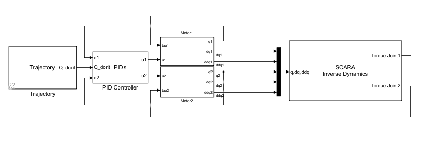
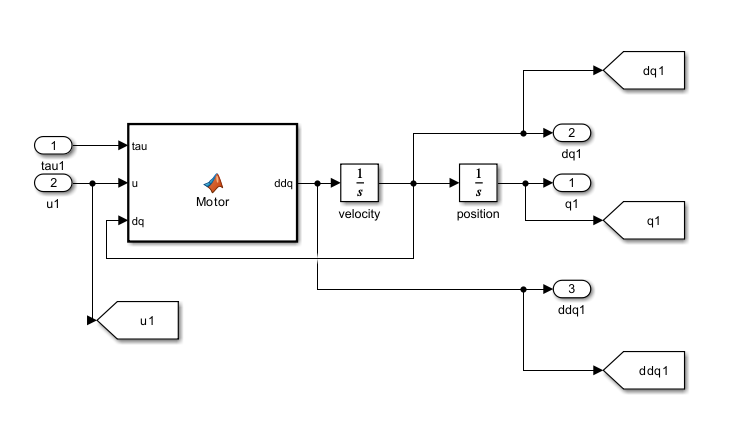
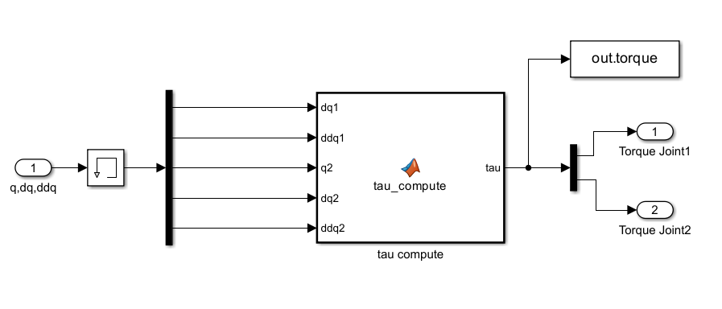

# scara-robot-modeling-and-control

TBD

<h1>TODO:</h1>
<del>Add dynamic model</del>  
<del>Add inverse dynamics control</del>  
<del>Add holist inverse dynamics control</del> 
<del>Add classical control</del> 
Add cartesian control 
<del>Add library</del>  
 
<h1>SCARA Dynamic Modelling and Control</h1>
In this project we will go over the mathematical modelling and control strategies of a SCARA robot arm. 

 

The SCARA robot arm usually presents four joints which consist of:
<ul>
    <li>Three revolute joints</li>
    <li>One prismatic joint</li>
</ul>

For now we simplify things and imagine the robot as just the first two revolute joints.  

<h2>Dynamic Modelling</h2>
Dynamic modelling is an important step in the analysis and modelling of a robotic arm as it establishes the mathematical relationship between the forces or moments, applied to the motors of the robotic arm, and the joint movements. The dynamic model incorporates physical properties of the robot such as: 
<ul>
    <li>Mass</li>
    <li>Moments of inertia</li>
    <li>Viscous forces</li>
    <li>Ficticious forces such as the Coriolis and Centrifugal</li>
    <li>Gravity</li>
</ul>

The dynamic model of the SCARA is represented through a complex matricial equation 

$M(q)\ddot{q} + N(q, \dot{q}) + G(q) + J^T(q)T_R + F(\dot{q}) + \tau_d = \tau$

<ul>
    <li>M(q) - inertia matrix</li>
    <li>N(q, \dot{q}) - coriolis & centrifugal matrices</li>
    <li>G(q) - gravity vector</li>
    <li>F(q) - viscous forces in the joint vector</li>
    <li>tau_d - moment perturbances vector</li>
</ul>

For easier computation of each vector and matrix we will use the Euler-Lagrange approach.

<h2>Inertia matrix</h2>
The inertia matrix for the SCARA robot is decoupled meaning that the links don't depend on eachother. 

$M(q) = \displaystyle\sum_{i=1}^{n} \left( m_i J_{vi}^T J_{vi} + J_{\omega i}^T I_{Ci} J_{\omega i} \right)$ 
where,
<ul>
    <li>m_i - the mass of the link</li>
    <li>I_Ci - the torsor of inertia in coordinate system of reference with regards to the COM</li>
    <li>J_vi & J_omegai - the components of the Jacobian in regards with regards to the COM</li>
</ul>

<h2>Coriolis & Centrifugal matrices</h2>
The coriolis & centrifugal forces are also known as ficticious forces because they only appear real to an object inside the system of reference. 
For the coriolis force, imagine yourself in a playground spinning wheel. From your point of view the world is spinning and you are stationary but for the outside observer you're rotating and the world is still. Now imagine you throw something. For you the trajectory of the throw seems to be a straight line but for the outside viewer it's a curved trajectory. 
For the centrifugal force, you can picture a semicircle road and as you drive on the road the car is "pulled" to the center of the semicircle keeping you on the road and not letting you fly off it. 
For our SCARA example we will see how these forces affect each link.

$$
C(q)[\dot{q}^2] = 
\begin{bmatrix}
b_{111} & b_{122} & \cdots & b_{1nn} \\
b_{211} & b_{222} & \cdots & b_{2nn} \\
\vdots & \vdots & \ddots & \vdots \\
b_{n11} & b_{n22} & \cdots & b_{nnn}
\end{bmatrix}
\begin{bmatrix}
\dot{q}_1^2 \\
\dot{q}_2^2 \\
\vdots \\
\dot{q}_n^2
\end{bmatrix}
$$

$$
B(q)[\dot{q}\dot{q}] = 
\begin{bmatrix}
2b_{112} & 2b_{123} & \cdots & 2b_{1n-1n} \\
2b_{212} & 2b_{223} & \cdots & 2b_{2n-1n} \\
\vdots & \vdots & \ddots & \vdots \\
2b_{n12} & 2b_{n23} & \cdots & 2b_{nn-1n}
\end{bmatrix}
\begin{bmatrix}
\dot{q}_1 \dot{q}_2 \\
\dot{q}_1 \dot{q}_3 \\
\vdots \\
\dot{q}_{n-1} \dot{q}_n
\end{bmatrix}
$$

where the Christoffel coefficients are:

$$
b_{ijk} = \frac{1}{2}(m_{ijk} + m_{ikj} + m_{jki})
$$

$$
m_{ijk} = \frac{\partial m_{ij}}{\partial q_k}
$$

where $m_{ij}$ is the element $ij$ of the matrix $M(q)$.

<h2>Control</h2>
Control is very important for influencing the behaviour of a dynamic model or a process. It's goal is to modify the input for the model/process based on the feedback it got. For our SCARA robot, the goal is to minimze the error between the desired value and the actual value given by the sensors. 

<h3>The components of a PID</h3>
The actual component that calculates the error and gives a new input for the model is called a PID Controller. 

<ul>
    <li>Proportional - it adjusts the real value so that it's proportional to the reference value. $u(t)=K_p\,e(t)$</li>
    <li>Integrative - it sums the error over time and adjusts the output to eliminate the steady-state error. $u(t)=K_i\int e(t)\,dt$</li>
    <li>Derivative - it reacts to the rate of change of the error and anticipates future errors. $u(t)=K_d\dfrac{de(t)}{dt}$</li>
</ul>

<h3>Control strategies</h3>
For this project we will be looking at four types of control strategies:
<ul>
    <li>Classical control</li>
    <li>Inverse dynamics holistic control</li>
    <li>Cartesian control</li>
    <li>Adaptive control</li>
</ul>

<h2>Classical Control</h2>
Classical control is aimed at controlling the motors of each joint. In this configuration the motor is controlled by a PID which determines the necessary voltage to be applied. The output of the motor is the set of movements applied to the joint ($q$, $\dot{q}$, $\ddot{q}$). These are then sent to the inverse dynamics block that acts as a generator of disturbances applied to the motor. 
To recap, a voltage is applied to the motor which generates a set of movements in the joint and that joint creates a moment which resists the motor which is then applied to the motor. 

<h3>Dynamic modelling of a DC motor</h3>
For our system to be as close as possible to reality we will take a holistic approach to modelling. This consists of the DC motor and the mechanical transmission. 

<h4>The electric component:</h4>

V = RI + L\frac{dI}{dt} + V_{emf} 
where, 
<ul>
    <li>$V$ - voltage</li>
    <li>$R$ - resistance of the armature</li>
    <li>$I$ - current flowing through the armature</li>
    <li>$L$ - inductance of the armature</li>
    <li>$V_{emf}$ - back EMF. $V_{emf}=k_{emf}\,\omega$, where $k_{emf}$ is the back EMF constant and $\omega$ is the angular velocity of the rotor.</li>
</ul>
 
<h4>The mechanical component:</h4>

$$
\begin{cases}
J_a \ddot{q}_a = -M + M_{\text{motor}} - b \dot{q} \\
\dot{q} = \dfrac{\dot{q}_a}{i_r} \\
\tau = i_r M \eta
\end{cases}
$$
where, 
<ul>
    <li>$J_a$ - moment of inertia (rotor + shaft)</li>
    <li>$\ddot{q}_a$, $\dot{q}_a$ - acceleration and velocity of the motor</li>
    <li>$M$ - resistive torque</li>
    <li>$M_{motor}$ - motor torque, $M_{motor}=k_M I$</li>
    <li>$b$ - viscous coefficient</li>
    <li>$\ddot{q}$, $\dot{q}$ - acceleration and velocity of the output shaft (after the gearing)</li>
    <li>$\tau$ - joint torque</li>
    <li>$\eta$ - efficiency of the motor + gearing</li>
</ul>

Now, after we looked at each component individually it's time we put them together to get the the whole picture.
First we will revisit the electrical component and we will consider, for simplification purposes, the inductance to be ideal thus making it equal to 0.

$$
\begin{aligned}
V &= RI + V_{emf} \\
\tau &= k_M I \\
V_{emf} &= k_M \dot{q}_m
&\;\Longrightarrow\;
V &= RI + k_M \dot{q}_m \\
\tau &= k_M I
&\;\Longrightarrow\;
I = \frac{V - k_M \dot{q}_m}{R}
\end{aligned}
$$

Now that we know the equation for the current passing through the motor we can replace it in the mechanical component and arrive at a generalized equation for our motor-gearing.

$$
\begin{aligned}
J_a \ddot{q}_a &= -M + M_{motor} - b \dot{q} \\
\dot{q} &= \frac{\dot{q}_a}{i_r}, \quad \dot{q}_a = \dot{q} i_r \\
\tau &= i_r M \eta \\
M_{motor} &= k_M I
\\[6pt]
&\Longrightarrow
\\[6pt]
J_a \ddot{q} i_r &= -\frac{\tau}{i_r \eta} + k_M I - b \dot{q} i_r \\
I &= \frac{V - k_M \dot{q} i_r}{R}
\end{aligned}
$$

Substitute the current $I$ into the mechanical transmission equation

$$
J_a\ddot{q}i_r = -\frac{\tau}{i_r\eta} + k_M \left(\frac{V-k_M\dot{q}}{R}\right) - b\dot{q}i_r
$$

$$
J_a\ddot{q}i_r = -\frac{\tau}{i_r\eta} + k_M\frac{V}{R} - \frac{k_M^2\dot{q}i_r}{R} - b\dot{q}i_r
$$

Factor out $\dot{q}$

$$
J_a\ddot{q}i_r = -\frac{\tau}{i_r\eta} + k_M\frac{V}{R} - \dot{q}i_r\left(b + \dot{q}\frac{k_M^2}{R}\right)
$$

$$
k_M\frac{V}{R} = J_a\ddot{q}i_r + \frac{\tau}{i_r\eta} + \dot{q}i_r\left(b + \dot{q}\frac{k_M^2}{R}\right)
$$

Multiply everything by $\frac{1}{i_r}$ to simplify the calculations and obtain the main equation

$$
k_M\frac{V}{Ri_r} = J_a\ddot{q} + \frac{\tau}{i_r^2\eta} + \dot{q}\left(b + \dot{q}\frac{k_M^2}{R}\right)
$$

Generalized for the $n$ joints:

$$
\mathrm{diag}\left(k_M\frac{1}{Ri_r}\right)V
=
\mathrm{diag}(J_a)\ddot{q}
+
\mathrm{diag}\left(\frac{1}{i_r^2\eta}\right)\tau
+
\mathrm{diag}\left(b + \dot{q}\frac{k_M^2}{R}\right)\dot{q}
$$

Where:

- diag() is the diagonal matrix with the corresponding elements  
- $q$, $\dot{q}$, $\ddot{q}$ are the joint motion vectors  
- **u** is the supply voltage vector  
- $\tau$ is the vector of torques driving the structure

<h3>Simulink implementation</h3>

Now that we know the equation for the motor we can move ahead and implement the classical control in Simulink and look at some results. 
Using the provided Simulink Library we can get all the blocks and stitch them together. 

 

## System Blocks Description

### Trajectory Block
Contains:
- $q_{desired}$
- $\dot{q}_{desired}$
- $\ddot{q}_{desired}$

Which are calculated by our trajectory function.

---

### $Motor_{1,2}$ Blocks
Contain the DC motor differential equations.

**Input parameters:**
- **tau** – resistive torque calculated by the inverse dynamics block  
- **u** – previously calculated control signal  
- **velocity** - of the motor 

The motor block contains our previously calculated equation

---

## Motor + Gearbox Specifications

### Motor + Gearbox Combination

| Parameter | Value |
|---|---|
| Maximum Voltage | 24 V |
| No-load Speed | 82.70 rpm |
| Maximum Speed | 68 rpm |
| Maximum Torque | 7.5 Nm |
| Maximum Current | 4.26 A |
| Efficiency $\eta$ | 57.59% |

---

### Motor Parameters

| Parameter | Value |
|---|---|
| Torque Coefficient $k_M$ | 27.3 mNm/A |
| Speed Constant $k_e$ | 350 rpm/V |
| Rotor Inertia $J_c$ | 72.8 g·cm² |
| Resistance R | 0.331 Ω |
| Inductance L | 0.103 mH |
| Motor Mass $M_m$ | 326.9 g |
| Length | 71.9 mm |
| Efficiency | 88.6% |

---

### Gearbox Parameters

| Parameter | Value |
|---|---|
| Ratio $i_r$ | 103:1 |
| Efficiency | 65% |

---

## SCARA Inverse Dynamics Block

Represents the SCARA robot structure where the torque required to be overcome by the motor is computed.

**Input parameters:**
- $q_2$ – motor commanded position  
- $dq_{1,2}$ – motor commanded speed  
- $ddq_{1,2}$ – motor commanded acceleration  

