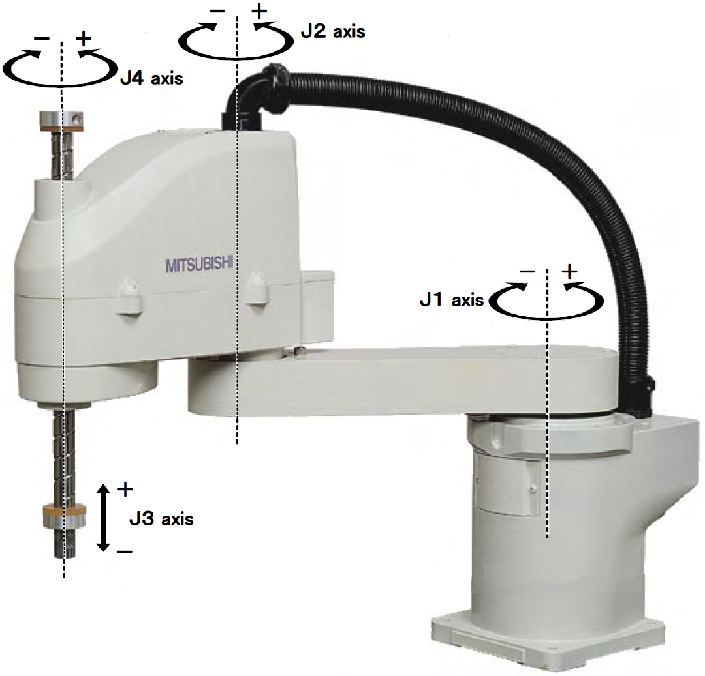

# scara-robot-modeling-and-control

TBD

<h1>TODO:</h1>
<del>Add dynamic model</del>  
<del>Add inverse dynamics control</del>  
<del>Add holist inverse dynamics control</del> 
<del>Add classical control</del> 
Add cartesian control 
<del>Add library</del>  
 
<h1>SCARA Dynamic Modelling and Control</h1>
In this project we will go over the mathematical modelling and control strategies of a SCARA robot arm.
